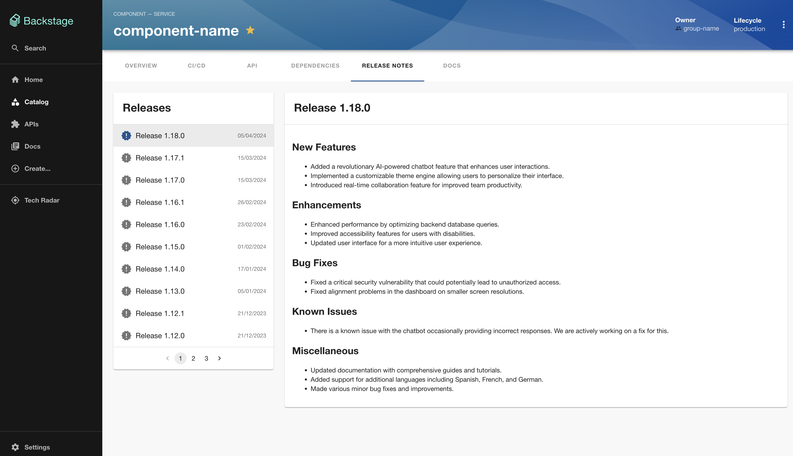

# Release Notes plugin for [Backstage](https://backstage.io)

## Overview

The Release Notes plugin is a plugin that displays all your releases for a component. The installation of this plugin can be found in the [README](./plugins/release-notes/README.md) of the plugin.

