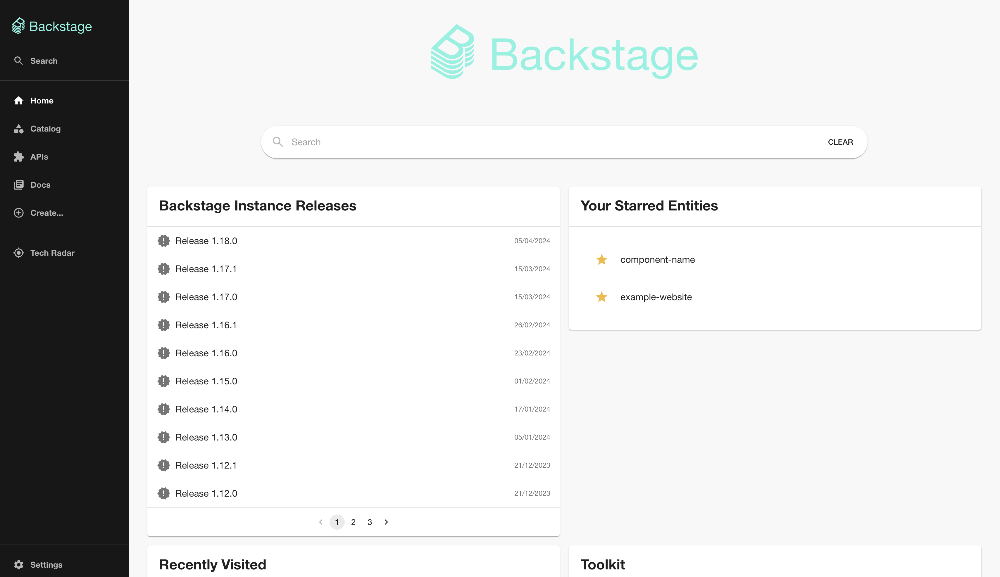

# Release Notes plugin for [Backstage](https://backstage.io)

## Overview

The Release Notes plugin is a frontend plugin that offers the following 2 functionalities:

- Shows all your releases for a component.
- Shows the releases of your Backstage instance on the homepage.

The installation of this plugin can be found in the [README](./plugins/release-notes/README.md) of the plugin.

**Example of releases for a component:**

**Example of the releases of your Backstage instance on the homepage:**

