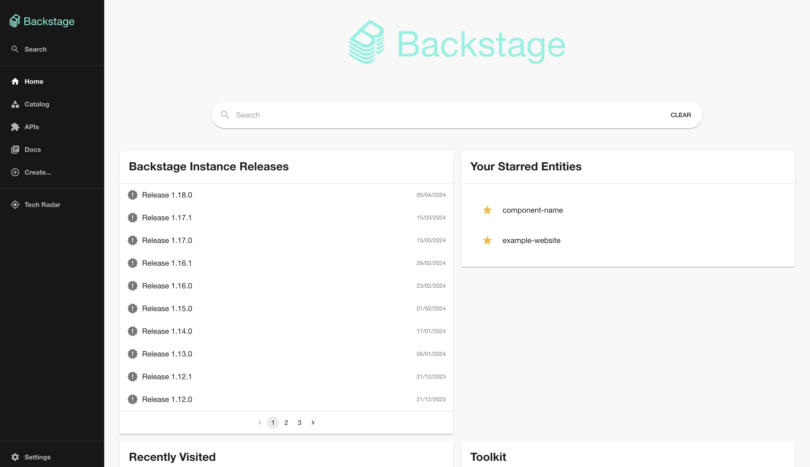

# Release Notes plugin for [Backstage](https://backstage.io)

## Overview

The Release Notes plugin is a frontend plugin that offers the following 2 functionalities:

- Shows all your releases for a component.
- Shows the releases of your Backstage instance on the homepage.

> **_NOTE:_** This plugin currently only works for GitLab (Support for GitHub will be added in the future).

**Example of releases for a component:**


**Example of the releases of your Backstage instance on the homepage:**



## Installation Steps

1. Add the plugin to you frontend app by running the following command from your Backstage root directory:

```shell
yarn --cwd packages/app add @stefank13/backstage-plugin-release-notes
```

2. In the `app-config.yaml` file in the Backstage root directory, add the new proxy config:

```yaml
proxy:
  '/gitlab':
    target: 'https://gitlab.com/api/v4'
    allowedHeaders: ['x-total-pages']
    headers:
      Authorization: 'Bearer ${GITLAB_TOKEN}'
```

3. Also in the `app-config.yaml` file in the Backstage root directory, add the exposed header to the backend cors config:

```yaml
backend:
  cors:
    exposedHeaders: ['x-total-pages']
```

4. Create a new group access token with the permission `read_api` (https://docs.gitlab.com/ee/user/group/settings/group_access_tokens) and provide it as `GITLAB_TOKEN` as env variable.

## Enabling Release Notes for a component

1. Import and add `EntityReleaseNotesContent` to `packages/app/src/components/catalog/EntityPage.tsx` for all the entity pages you want the Release Notes to be in:

   ```typescript jsx
   import { EntityReleaseNotesContent } from '@stefank13/backstage-plugin-release-notes';

   //...

   const serviceEntityPage = (
     <EntityLayout>
       //...
       <EntityLayout.Route path="/release-notes" title="Release Notes">
         <EntityReleaseNotesContent />
       </EntityLayout.Route>
       //...
     </EntityLayout>
   );

   const websiteEntityPage = (
     <EntityLayout>
       //...
       <EntityLayout.Route path="/release-notes" title="Release Notes">
         <EntityReleaseNotesContent />
       </EntityLayout.Route>
       //...
     </EntityLayout>
   );

   const defaultEntityPage = (
     <EntityLayout>
       //...
       <EntityLayout.Route path="/release-notes" title="Release Notes">
         <EntityReleaseNotesContent />
       </EntityLayout.Route>
       //...
     </EntityLayout>
   );
   ```

2. Add the following annotation to the `catalog-info.yaml` for an entity you want to show the Release Notes for:

   ```yaml
   metadata:
     annotations:
       gitlab.com/project-slug: 'project-slug' #group_name/project_name
   ```

## Enabling Release Notes for your Backstage instance on the homepage

1. Before you can add the Release Notes card for the homepage, make sure you have configured the homepage. You can read how to do that [here](https://backstage.io/docs/getting-started/homepage/).

2. When the homepage is configured, it's time to enable the `HomePageReleaseNotesCard`, this component expects the following 2 props:

   - `projectSlug`: This is the slug of your backstage instance git project.
   - `title`: This is the title of the card.

   For example, if your Backstage instance is called Dev Central, the props can have the following values:

   - `projectSlug`: developer-portal/dev-central
   - `title`: Dev Central Releases

3. Import and add `HomePageReleaseNotesCard` to `packages/app/src/components/home/HomePage.tsx`. The `HomePageReleaseNotesCard` e:

   ```typescript jsx
   import { HomePageReleaseNotesCard } from '@stefank13/backstage-plugin-release-notes';

   //...

   export const HomePage = () => {
     <SearchContextProvider>
       <Page themeId="home">
         //...
         <Grid item xs={12} md={6}>
           <HomePageReleaseNotesCard
             projectSlug="developer-portal/dev-central"
             title="Dev Central Releases"
           />
         </Grid>
         //...
       </Page>
     </SearchContextProvider>;
   };
   ```
