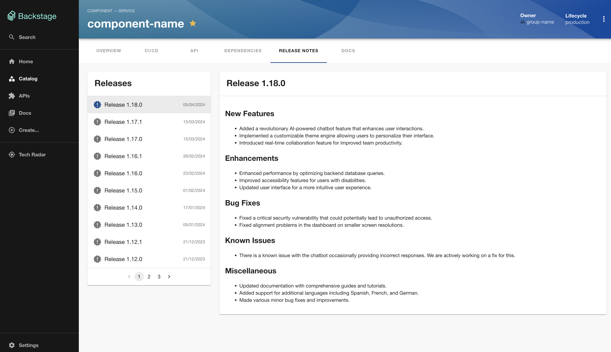
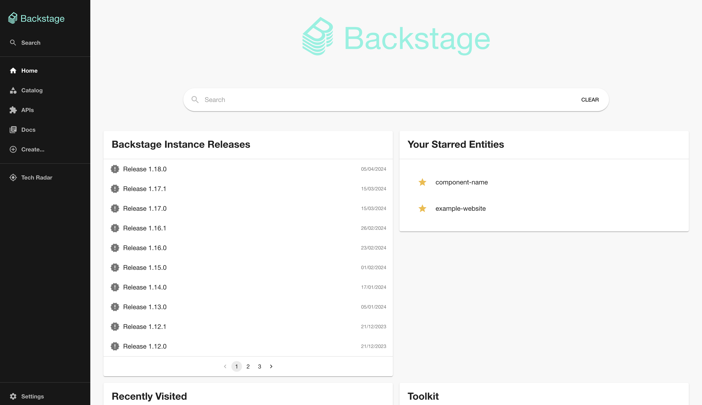

# Release Notes plugin for [Backstage](https://backstage.io)

> [!WARNING] > **Breaking change — v1.0.0 and above requires the New Frontend System.**
> The plugin now ships as a New Frontend System plugin only and must be used with `@backstage/frontend-defaults` (or any NFS-compatible Backstage app). If you are still on the old frontend system, stay on `v0.1.0`.

## Overview

The Release Notes plugin is a frontend plugin that offers the following 2 functionalities:

- Shows all your releases for a component.
- Shows the releases of your Backstage instance.

> **_NOTE:_** This plugin currently only works for GitLab (Support for GitHub will be added in the future).

**Example of releases for a component:**



**Example of the releases of your Backstage instance:**



## Installation Steps

1. Add the plugin to you frontend app by running the following command from your Backstage root directory:

```shell
yarn --cwd packages/app add @stefank13/backstage-plugin-release-notes
```

2. In the `app-config.yaml` file in the Backstage root directory, add the new proxy config:

```yaml
proxy:
  '/gitlab':
    target: 'https://gitlab.com/api/v4'
    allowedHeaders: ['x-total-pages']
    headers:
      Authorization: 'Bearer ${GITLAB_TOKEN}'
```

3. Also in the `app-config.yaml` file in the Backstage root directory, add the exposed header to the backend cors config:

```yaml
backend:
  cors:
    exposedHeaders: ['x-total-pages']
```

4. Create a new group access token with the permission `read_api` (https://docs.gitlab.com/ee/user/group/settings/group_access_tokens) and provide it as `GITLAB_TOKEN` as env variable.

## Enabling Frontend Plugin

Add the plugin to your app's feature list in `packages/app/src/App.tsx`:

```typescript
import { createApp } from '@backstage/frontend-defaults';
import { releaseNotesPlugin } from '@stefank13/backstage-plugin-release-notes';

const app = createApp({
  features: [
    // ... other plugins
    releaseNotesPlugin,
  ],
});

export default app.createRoot();
```

## Enabling Release Notes for a component

Once the frontend plugin is enabled, the Release Notes tab is displayed by default for entities of the following kinds: Component, Resource, and API.

## Using the Release Notes card in your Backstage frontend

The `ReleaseNotesCard` component can be added to any React page in your Backstage frontend.

### Configure the Release Notes card

The component requires the following props:

- `projectSlug` – The slug of the Git repository that contains your Backstage instance.
- `title` – The title displayed at the top of the card.

For example, if your Backstage instance is called **Dev Central**, you could use:

- `projectSlug`: `developer-portal/dev-central`
- `title`: `Dev Central Releases`

### Add the card to your page

Import `ReleaseNotesCard` and render it wherever you want it to appear.

```tsx
import { ReleaseNotesCard } from '@stefank13/backstage-plugin-release-notes';

// ...

<Grid item xs={12} md={6}>
  <ReleaseNotesCard
    projectSlug="developer-portal/dev-central"
    title="Dev Central Releases"
  />
</Grid>;
```

For example, you can add the card to a custom page alongside other components:

```tsx
<Grid container item xs={12}>
  <Grid item xs={12} md={6}>
    <ReleaseNotesCard
      projectSlug="developer-portal/dev-central"
      title="Dev Central Releases"
    />
  </Grid>

  <Grid item xs={12} md={6}>
    <HomePageStarredEntities />
  </Grid>
</Grid>
```

The card will display the latest releases for the configured repository.
